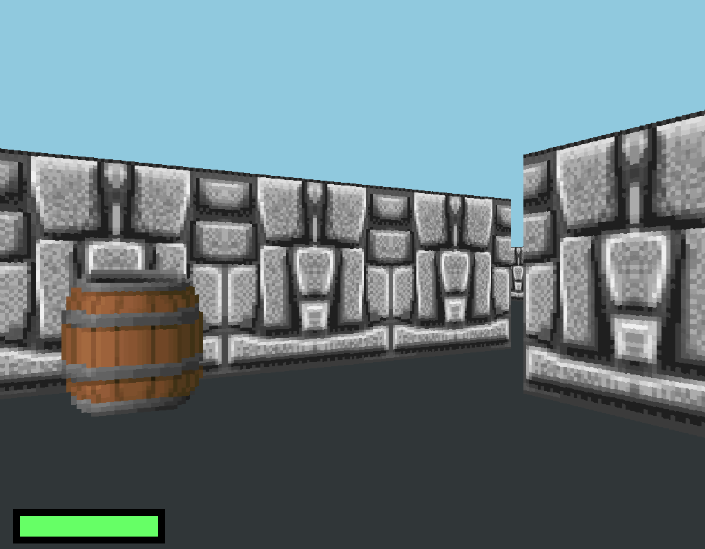
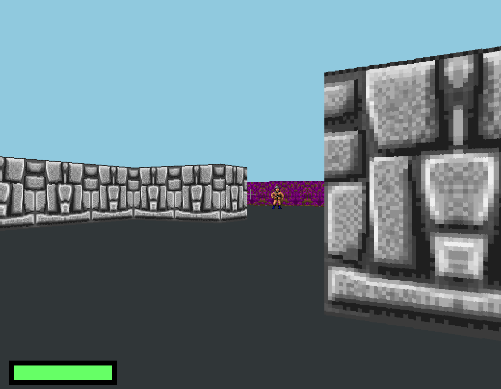
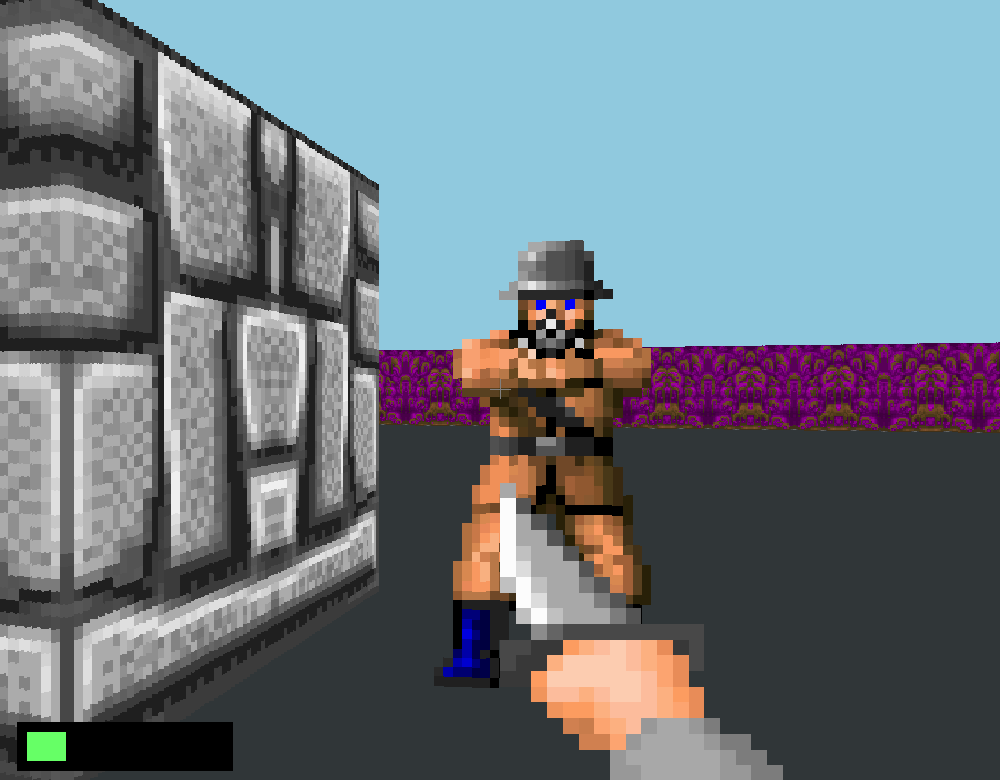

# PixelGame

This project implements a game engine using the SDL2 library with rudimentary 3D graphics rendered with raycasting. It supports rendering rectangular walls and sprites facing the direction of the camera as well as projectiles and simple pathfinding.

This implementation of raycasting works by projecting rays starting from the player in various directions until they hit an opaque wall. The perpendicular distance between the camera plane (a surface representing the screen) and the wall is then the length of the wall to be rendered on screen. Each ray is responsible for one vertical column on the screen.

The textures and sprites used in the demonstration are from [Wolfenstein 3D](https://en.wikipedia.org/wiki/Wolfenstein_3D).

# Building

First, run this command to install the necessary packages:

```
apt-get install mesa-utils libsdl2-dev libsdl2-ttf-dev libsdl2-ttf-dev
```

Run the following commands in the terminal to build this project:

```
git clone https://github.com/BattleMage0231/PixelGame.git
cd PixelGame
git submodule update --init --recursive
mkdir build && cd build
cmake ..
make
```

The executable will then be built at `./game`.

# Build with Emscripten

Run the following command to build with Emscripten:

```
emcc ./src/*.cc \
    -o build/game.html \
    -I./include \
    -I/usr/local/include \
    -s USE_SDL=2 \
    -s USE_SDL_IMAGE=2 \
    -s SDL2_IMAGE_FORMATS='["gif"]' \
    -s USE_SDL_TTF=2 \
    -s USE_GLFW=3 \
    --embed-file assets@/assets \
    -s ALLOW_MEMORY_GROWTH=1 \
    -s WASM=1 \
    -O3 \
    -std=c++17
```

# Gallery






